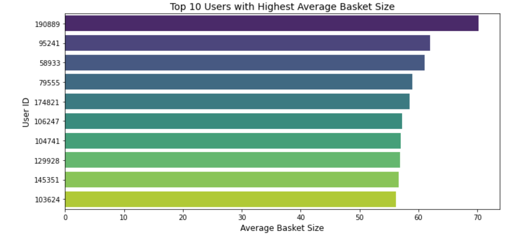

# 🛒 Instacart Market Basket Analysis (SQL + Python)

This project explores Instacart's real-world grocery ordering data using **Databricks SQL** and **Python visualizations**. It simulates how a Data Scientist at Instacart might analyze shopping behaviors to generate actionable business insights.

Description: “Instacart Market Basket EDA using Databricks (Spark SQL + Python).”
Topics: databricks spark sql python eda instacart seaborn pyspark

---

## 📦 Dataset

The data comes from the [Instacart Market Basket 2017 dataset](https://www.kaggle.com/competitions/instacart-market-basket-analysis/data) and includes:

- `orders.csv`: metadata for each order placed by users
- `order_products__prior.csv`: prior order details (product-level)
- `products.csv`, `aisles.csv`, `departments.csv`: metadata for each product

---

## 🛠 Tools Used

- **Databricks (Community Edition)** for Spark SQL and notebooks
- **PySpark SQL** for querying large-scale datasets
- **Pandas** for data wrangling
- **Matplotlib & Seaborn** for visualizations

> 🧠 This analysis was conducted entirely in **Databricks Community Edition** using Spark SQL, PySpark, and Python visualizations.

---

## 📁 View the Code & Outputs

- [📄 View full notebook source (`.ipynb`)](https://github.com/rehansc/Instacart-eda-sql/blob/main/instacart_eda_sql.ipynb)


---

## 📊 Visualizations

## 📊 Visual Results

### 1. **Top 10 Most Ordered Products**
Shows the most frequently purchased products across all orders.


### 2. **Top 10 Most Reordered Aisles**
Highlights aisles with highest reorder rates — staple categories.


### 3. **Top 10 Users with Highest Average Basket Size**
Identifies users who place large orders, indicating high-value behavior.


### 4. **Basket Size Distribution**
A histogram showing how many items are typically ordered.


### 5. **Order Count by Day of Week and Hour of Day**
Heatmap showing time-of-day and day-of-week order trends.


---

## 💡 Key Business Insights

- **Produce & dairy dominate reorders** → Opportunity for upsell/retargeting.
- **High-value users place large baskets** → Focus for loyalty/retention.
- **Peak shopping: weekends, late mornings** → Ideal ad & ops timing.
- **Most baskets are 5–15 items** → Promotions can nudge to higher order values.

---

## 📁 Suggested Repository Structure

```
instacart-eda-sql/
├── notebooks/
│   ├── instacart_week1_notebook.py
│   └── instacart_week1_output.html
├── images/                        # optional
│   └── *.png                      # charts (optional)
├── README.md
└── .gitignore
```

---

## ✅ Next Steps

- Add predictive modeling (e.g., reorder prediction)
- Build dashboards (Power BI, Tableau, or Streamlit)
- Expand to personalized recommendations

---

## 🔗 Author

**Rehan Chaudhry**  
[GitHub Portfolio](https://github.com/rehansc)  
[LinkedIn](https://www.linkedin.com/in/rehanchaudhry/)


---
